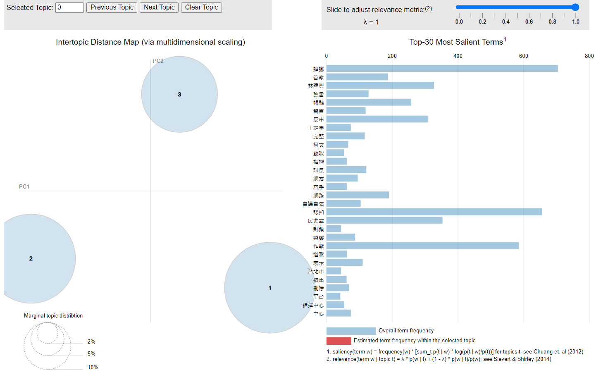
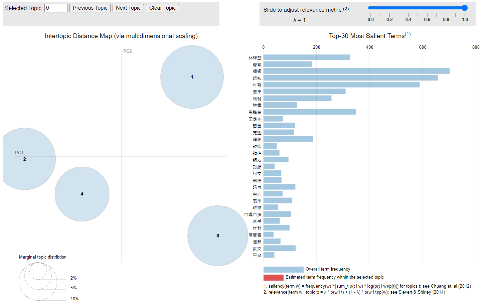

## 主題
 PTT八卦版:鄉民因為近日疫情持續延燒，對政府的一連串帶動網路風向的行為感到不滿。

## 動機和分析目的

  觀察時間為2021年5月1日~5月29日。在這段期間，台灣本土武漢肺的疫情炎持續延燒，在疫情期間政府稱PTT是中國假訊息的發源地之一，並表示這些是中國對台灣所發起的“認知作戰”，但隨後被鄉民以肉蒐的方式查出其假訊息提供者本身為民進黨支持者，卻在ptt上發表反執政黨的言論有明顯自導自演的跡象，因此，我們嘗試使用文字探勘以及情緒分析的方式來探討廣大網民對於此事件的看法。

## 資料基本介紹

+ 資料來源: 文字平台收集PTT Gossip版2021-05-01到 2021-05-24 所有文章
+ 資料集： army_a.csv(內文),army_r.csv(回文)
+ 關鍵字：‘網軍’,‘林瑋豐’,‘蟑螂’,‘自導自演’,‘一條龍’,‘認知作戰’,‘認吱作戰’
+ 資料時間：2021-05-01 ~ 2021-05-24

主要分析ptt上網友的相關討論，本次主要針對以下方向分析:

> 1.分析五月份鄉民的討論熱度，有哪些話題高峰?
</br>
> 2.分析正面還有負面文章的內容
</br>
> 3.利用LDA來看看在這個月鄉民主要在討論什麼
</br>
> 4.利用LDA結果，找出各類文章的意見領袖
</br>


系統參數設定
```{r,warning=FALSE,message=FALSE}
Sys.setlocale(category = "LC_ALL", locale = "zh_TW.UTF-8") # 避免中文亂碼
```

安裝需要的packages
```{r warning=FALSE}
# echo = T,results = 'hide'
packages = c("dplyr", "tidytext", "stringr", "wordcloud2", "ggplot2",'readr','data.table','reshape2','wordcloud','tidyr','scales')
existing = as.character(installed.packages()[,1])
for(pkg in packages[!(packages %in% existing)]) install.packages(pkg)
```

讀進library
```{r,warning=FALSE,message=FALSE}
rm(list=ls(all=T))
library(dplyr)
library(stringr)
library(tidytext)
library(wordcloud2)
library(data.table)
library(ggplot2)
library(reshape2)
library(wordcloud)
library(tidyr)
library(readr)
library(scales)
library(jiebaR)
library(janeaustenr)
library(ngram)
library(widyr)
library(readr)
library(NLP)
library(ggraph)
library(igraph)
library(tm)
library(topicmodels)
library(purrr)
library(RColorBrewer)
library(LDAvis)
library(slam)

mycolors <- colorRampPalette(brewer.pal(8, "Set3"))(20)


```


```{r}
# 把文章和留言讀進來
MetaData = fread('csv/army_a.csv',encoding = 'UTF-8')
Reviews  = fread('csv/army_r.csv',encoding = 'UTF-8')

# 再篩一次文章,從1067篩到剩下982
keywords =  c('網軍','林瑋豐','自導自演','一條龍','認知作戰','認吱作戰')
toMatch = paste(keywords,collapse="|")
MetaData = with(MetaData, MetaData[grepl(toMatch,sentence)|grepl(toMatch,artTitle),])

# 挑選文章對應的留言,從96537到89176
reviews <- Reviews %>%
      select(artUrl, cmtPoster, cmtStatus, cmtContent)
Reviews2 = left_join(MetaData, Reviews[,c("artUrl", "cmtContent","cmtPoster","cmtStatus")], by = "artUrl")
Reviews = left_join(MetaData, Reviews[,c("artUrl", "cmtContent")], by = "artUrl")

```


## 1. 資料前處理

(1). 文章斷詞

設定斷詞引擎
```{r}
# 加入自定義的字典
jieba_tokenizer <- worker(user="dict/user_dict.txt", stop_word = "dict/stop_words.txt")

# 設定斷詞function
customized_tokenizer <- function(t) {
  lapply(t, function(x) {
    tokens <- segment(x, jieba_tokenizer)
    return(tokens)
  })
}
```

```{r}
# 把文章和留言的斷詞結果併在一起
MToken <- MetaData %>% unnest_tokens(word, sentence, token=customized_tokenizer)
RToken <- Reviews %>% unnest_tokens(word, cmtContent, token=customized_tokenizer)

# 把資料併在一起
data <- rbind(MToken[,c("artDate","artUrl", "word")],RToken[,c("artDate","artUrl", "word")]) 
```

(2). 資料基本清理

+ 日期格式化
+ 去除特殊字元、詞頻太低的字

```{r}
# 格式化日期欄位
data$artDate= data$artDate %>% as.Date("%Y/%m/%d")


# 過濾特殊字元
data_select = data %>% 
  filter(!grepl('[[:punct:]]',word)) %>% # 去標點符號 
  filter(!grepl("['^0-9a-z']",word)) %>% # 去英文、數字
  filter(nchar(.$word)>1) 

  
# 算每天不同字的詞頻
# word_count:artDate,word,count
word_count <- data_select %>%
  select(artDate,word) %>%
  group_by(artDate,word) %>%
  summarise(count=n()) %>%  # 算字詞單篇總數用summarise
  filter(count>3) %>%  # 過濾出現太少次的字
  arrange(desc(count))

```
```{r}
P <- read_file("dict/liwc/positive.txt") # 正向字典txt檔
N <- read_file("dict/liwc/negative.txt") # 負向字典txt檔

#字典txt檔讀進來是一整個字串
typeof(P)
```

建立liwc情緒字典
```{r}
# 將字串依,分割
# strsplit回傳list , 我們取出list中的第一個元素
P = strsplit(P, ",")[[1]]
N = strsplit(N, ",")[[1]]

# 建立dataframe 有兩個欄位word,sentiments，word欄位內容是字典向量
P = data.frame(word = P, sentiment = "positive") #661
N = data.frame(word = N, sentiment = "negative") #1049

# 把兩個字典拼在一起
LIWC = rbind(P, N)
```


## 統計每日貼文數量
```{r}
#每日統計貼文
date = data %>% select(artDate, artUrl) %>% distinct()
date = date %>% group_by(artDate) %>% summarize(count_day = n()) %>% ungroup() 
date  = date %>% arrange(desc(count_day))
```

```{r}
date_plot <- date %>% 
  ggplot(aes(x = artDate, y = count_day)) +
  geom_line(color = "purple", size = 1.5) +
   #geom_vline(xintercept = c(as.numeric(as.Date("2021-03-23")),
                            #as.numeric(as.Date("2020-10-23")),
                           # as.numeric(as.Date("2020-09-10"))
                            #), col='red', size = 1) + 
  scale_x_date(labels = date_format("%Y/%m/%d")) +
  scale_x_date(breaks = "1 week") +
  ggtitle("討論文章數") + 
   geom_line(color="red")+
    geom_point()+
  xlab("日期") + 
  ylab("數量")
date_plot
```


## 5/04、5/20、5/24字詞統計圖
```{r}
g_tokens_by_date <- data_select %>% count(artDate, word, sort = TRUE)
  
plot_merge <- g_tokens_by_date %>% 
  filter(artDate == as.Date("2021-05-04") | 
         artDate == as.Date("2021-05-20") | 
         artDate == as.Date("2021-05-24")) %>% 
  group_by(artDate) %>% 
  top_n(7, n) %>% 
  ungroup() %>% 
  mutate(word = reorder(word, n)) %>%
  ggplot(aes(x=word, y=n, fill = artDate)) +
  geom_col(show.legend = FALSE) +
  labs(x = NULL, y = NULL) +
  facet_wrap(~artDate, scales="free", ncol = 2) + 
  coord_flip()
plot_merge
```

## 觀察出現在'林瑋豐'附近的詞彙
林瑋豐簡介:
林瑋豐原先任職於YouTube眼球中央電視台頻道的劇本作者，並與任職民進黨網路社群中心副主任的楊敏為夫妻關係，日前林瑋豐在臉書上表示，ＰＴＴ有許多帳號在洗版，鼓吹民眾移除或封鎖疾管署ＬＩＮＥ帳號「疾管家」，被網友揪出整起事件就是由他一人自導自演，在事情爆發後，他本人道歉並表示自己是在惡搞反串，但仍被鄉民們檢舉違反國安法假訊息。
```{r}
ngram_11 <- function(t) {
  lapply(t, function(x) {
    tokens <- segment(x, jieba_tokenizer)
    ngram <- ngrams(tokens, 11)
    ngram <- lapply(ngram, paste, collapse = " ")
    unlist(ngram)
  })
}

data_army <- MetaData %>%
  select(artUrl, sentence) %>%
  unnest_tokens(word, sentence, token = customized_tokenizer)

data_army= data_army %>%  filter(data_army$word == "網軍"|!str_detect(word, regex("[0-9a-zA-Z]")))

w = data_army %>% group_by(artUrl) %>% summarize(sentence = paste(word,collapse = ""))

g_ngram_11 <- w %>%
  select(artUrl, sentence) %>%
  unnest_tokens(ngram, sentence, token = ngram_11)

g_ngrams_11_separated <- g_ngram_11 %>%
  separate(ngram, paste0("word", c(1:11),sep=""), sep = " ")
```


```{r}
g_check_words <- g_ngrams_11_separated %>%
  filter(word6 == "林瑋豐")
```


```{r}
g_check_words_count <- g_check_words %>%
  melt(id.vars = "artUrl", measure.vars = paste0("word", c(1:11),sep="")) %>%
  rename(word=value) %>%
  filter(variable!="word6") %>%
  filter(!(word %in% stop_words), nchar(word)>1) %>%
  count(word, sort = TRUE)
g_check_words_count %>%
  arrange(desc(abs(n))) %>%
  head(15) %>%
  mutate(word = reorder(word, n)) %>%
  ggplot(aes(word, n, fill = n > 0)) +
  geom_col(show.legend = FALSE) +
  xlab("出現在「林瑋豐」附近的字") +
  ylab("出現次數") +
  coord_flip()
```

## 字詞關聯圖
```{r}
g_words_by_art <- data_select %>%
  count(artUrl, word, sort = TRUE)
g_word_pairs <- g_words_by_art %>%
  pairwise_count(word, artUrl, sort = TRUE)
```

```{r}
g_word_cors <- g_words_by_art %>%
  group_by(word) %>%
  filter(n() >= 20) %>%
  pairwise_cor(word, artUrl, sort = TRUE)
```


```{r}
threshold <- 0.6 #手動調參
remove_words <- g_word_cors %>%
                filter(correlation>threshold) %>%
                .$item1 %>%
                unique()
set.seed(2017)
g_word_cors_new <- g_word_cors %>%
                filter(!(item1 %in% remove_words|item2 %in% remove_words))

g_word_cors_new %>%
  filter(correlation > .474) %>%
  graph_from_data_frame() %>%
  ggraph(layout = "fr") +
  geom_edge_link(aes(edge_alpha = correlation), show.legend = FALSE) + 
  geom_node_point(color = "lightblue", size = 3) +
  geom_node_text(aes(label = name), repel = TRUE) +
  theme_void()
```


```{r}
sentiment_count = data_select %>%
  select(artDate,word) %>%
  inner_join(LIWC) %>% 
  group_by(artDate,sentiment) %>%
  summarise(count=n()) 
```


```{r}
range(sentiment_count$artDate)
```

## 5月正負情緒折線圖
```{r}
sentiment_count %>%
  ggplot()+
  geom_line(aes(x=artDate,y=count,colour=sentiment))+

  scale_x_date(labels = date_format("%Y/%m/%d"),
               limits = as.Date(c('2021-05-01','2021-05-29'))
               )+
  # 加上標示日期的線
  geom_vline(aes(xintercept = as.numeric(artDate[which(sentiment_count$artDate == as.Date('2021-05-03'))
[1]])),colour = "green",linetype=4) +
  # 加上標示日期的線
  geom_vline(aes(xintercept = as.numeric(artDate[which(sentiment_count$artDate == as.Date('2021-05-20'))
[1]])),colour = "green",linetype=4) +
  # 加上標示日期的線
  geom_vline(aes(xintercept = as.numeric(artDate[which(sentiment_count$artDate == as.Date('2021-05-24'))
[1]])),colour = "green",linetype=4) 
```

## 5月正負情緒比例折線圖
```{r}
sentiment_count %>% 
  # 標準化的部分
  group_by(artDate) %>%
  mutate(ratio = count/sum(count)) %>%
  # 畫圖的部分
  ggplot()+
  geom_line(aes(x=artDate,y=ratio,colour=sentiment))+
  scale_x_date(labels = date_format("%m/%d"),
               limits = as.Date(c('2021-05-01','2021-05-29'))
               )
```

## 5/24正負情緒折線圖
```{r}
sentiment_count %>%  filter(artDate<=as.Date("2021-05-29",format="%Y-%m-%d"))%>%
  group_by(artDate) %>%
  mutate(ratio = count/sum(count)) %>%
  ggplot()+
  geom_line(aes(x=artDate,y=ratio,colour=sentiment))+
  scale_x_date(labels = date_format("%m/%d"),
               limits = as.Date(c('2021-05-20','2021-005-29'))
               )+
  geom_vline(aes(xintercept = as.integer(as.Date("2021-05-24",format="%Y-%m-%d"))), col = "black",linetype=4)
```

## 5/24文字雲 (詞頻>200)
```{r}
# 畫出文字雲
 word_count  %>%
  filter(artDate == as.Date('2021-05-24')) %>% 
  select(word,count) %>% 
  group_by(word) %>% 
  summarise(count = sum(count)) %>%
  arrange(desc(count)) %>%
  filter(count>200) %>%   # 過濾出現太少次的字
  wordcloud2()
```


```{r}
# sentiment_sum:word,sentiment,sum
sentiment_sum <- 
  word_count %>%
   filter(artDate == as.Date('2021-05-24')) %>% 
    inner_join(LIWC) %>%
    group_by(word,sentiment) %>%
  summarise(
    sum = sum(count)
  ) %>% 
  arrange(desc(sum)) %>%
  data.frame() 
```

## 正負情緒貢獻圖
```{r}
sentiment_sum %>%
  top_n(20,wt = sum) %>%
  mutate(word = reorder(word, sum)) %>%
  ggplot(aes(word, sum, fill = sentiment)) +
  geom_col(show.legend = FALSE) +
  facet_wrap(~sentiment, scales = "free_y") +
  labs(y = "Contribution to sentiment",
       x = NULL) +
  theme(text=element_text(size=14))+
  coord_flip()
```

## 正負情緒文字雲(各取前50字)
```{r}
sentiment_sum %>%
  acast(word ~ sentiment, value.var = "sum", fill = 0) %>%
  comparison.cloud(
    colors = c("salmon", "#72bcd4"), # positive negative
                   max.words = 50)
```


```{r}
article_type = 
  data_select %>%
  inner_join(LIWC) %>% 
  group_by(artUrl,sentiment) %>%
  summarise(count=n()) %>%
  spread(sentiment,count,fill = 0) %>% # 把正負面情緒展開，缺值補0
  mutate(type = case_when(positive > negative ~ "positive", 
                             TRUE ~ "negative")) %>%
  data.frame() 
```


```{r}
# 看一下正負比例的文章各有幾篇
article_type %>%
  group_by(type) %>%
  summarise(count = n())
```

## 5月的正負情緒文章比例圖
```{r}
article_type_date = left_join(article_type[,c("artUrl", "type")], MetaData[,c("artUrl", "artDate")], by = "artUrl")
article_type_date$artDate = as.Date(article_type_date$artDate,format="%Y/%m/%d")

article_type_date %>%
  group_by(artDate,type) %>%
  summarise(count = n()) %>%
  ggplot(aes(x = artDate, y = count, fill = type)) + 
  geom_bar(stat = "identity", position = "dodge")+
  scale_x_date(labels = date_format("%m/%d"),
               limits = as.Date(c('2021-05-01','2021-05-29'))
               )
```


```{r}

# 格式化日期欄位
MToken$artDate= MToken$artDate %>% as.Date("%Y/%m/%d")


# 過濾特殊字元
data_select_a = MToken %>% 
  filter(!grepl('[[:punct:]]',word)) %>% # 去標點符號 
  filter(!grepl("['^0-9a-z']",word)) %>% # 去英文、數字
  filter(nchar(.$word)>1) 

  
# 算每天不同字的詞頻
# word_count:artDate,word,count
tokens <- data_select_a %>%
  select(artUrl,word) %>%
  group_by(artUrl,word) %>%
  summarise(count=n()) %>%  # 算字詞單篇總數用summarise
   # 過濾出現太少次的字
  arrange(desc(count))


```

```{r}
dtm <-tokens %>% cast_dtm(artUrl, word, count)
dtm
```

```{r}
inspect(dtm[1:10,1:10])
```

##LDA
```{r}
lda <- LDA(dtm, k = 2, control = list(seed = 2021))
```

```{r}
topics_words <- tidy(lda, matrix = "beta") # 注意，在tidy function裡面要使用"beta"來取出Phi矩陣。
colnames(topics_words) <- c("topic", "term", "phi")
topics_words
```

```{r}
topics_words %>%
  group_by(topic) %>%
  top_n(10, phi) %>%
  ungroup() %>%
  mutate(top_words = reorder_within(term,phi,topic)) %>%
  ggplot(aes(x = top_words, y = phi, fill = as.factor(topic))) +
  geom_col(show.legend = FALSE) +
  facet_wrap(~ topic, scales = "free") +
  coord_flip() +
  scale_x_reordered()
```

## 尋找最佳主題數

```{r}
ldas = c()
topics = c(2,3,4,6,10,15)
for(topic in topics){
  start_time <- Sys.time()
  lda <- LDA(dtm, k = topic, control = list(seed = 2021))
  ldas =c(ldas,lda)
 print(paste(topic ,paste("topic(s) and use time is ", Sys.time() -start_time)))
save(ldas,file = "ldas_result.rdata") # 將模型輸出成檔案
}


```

```{r}
#("ldas_result.rdata")
```

```{r}
topics = c(2,3,4,6,10,15)
data_frame(k = topics, perplex = map_dbl(ldas, topicmodels::perplexity)) %>%
  ggplot(aes(k, perplex)) +
  geom_point() +
  geom_line() +
  labs(title = "Evaluating LDA topic models",
       subtitle = "Optimal number of topics (smaller is better)",
       x = "Number of topics",
       y = "Perplexity")
```

```{r}
topicmodels_json_ldavis <- function(fitted, doc_term){
    require(LDAvis)
    require(slam)
  
    ###以下function 用來解決，主題數多會出現NA的問題
    ### 參考 https://github.com/cpsievert/LDAvis/commit/c7234d71168b1e946a361bc00593bc5c4bf8e57e
    ls_LDA = function (phi){
      jensenShannon <- function(x, y) {
        m <- 0.5 * (x + y)
        lhs <- ifelse(x == 0, 0, x * (log(x) - log(m+1e-16)))
        rhs <- ifelse(y == 0, 0, y * (log(y) - log(m+1e-16)))
        0.5 * sum(lhs) + 0.5 * sum(rhs)
      }
      dist.mat <- proxy::dist(x = phi, method = jensenShannon)
      pca.fit <- stats::cmdscale(dist.mat, k = 2)
      data.frame(x = pca.fit[, 1], y = pca.fit[, 2])
    }
  
      # Find required quantities
      phi <- as.matrix(posterior(fitted)$terms)
      theta <- as.matrix(posterior(fitted)$topics)
      vocab <- colnames(phi)
      term_freq <- slam::col_sums(doc_term)
  
      # Convert to json
      json_lda <- LDAvis::createJSON(phi = phi, theta = theta,
                                     vocab = vocab,
                                     doc.length = as.vector(table(doc_term$i)),
                                     term.frequency = term_freq, mds.method = ls_LDA)
  
      return(json_lda)
}
```

```{r}
the_lda = ldas[[2]]
json_res <- topicmodels_json_ldavis(the_lda,dtm)
#serVis(json_res,open.browser = T)

```


#也嘗試過分4個topic(但我們認為第2還有4的主題太過相近，因此選擇分三群)

## LDA分析
```{r}
the_lda = ldas[[2]] ## 選定topic 為 3 的結果
```

```{r}
topics_words <- tidy(the_lda, matrix = "beta") # 注意，在tidy function裡面要使用"beta"來取出Phi矩陣。
colnames(topics_words) <- c("topic", "term", "phi")
topics_words %>% arrange(desc(phi)) %>% head(10)

```

```{r}
topics_words %>%
  group_by(topic) %>%
  top_n(10, phi) %>%
  ungroup() %>%
  ggplot(aes(x = reorder_within(term,phi,topic), y = phi, fill = as.factor(topic))) +
  geom_col(show.legend = FALSE) +
  facet_wrap(~ topic, scales = "free") +
  coord_flip() +
  xlab("topic")+
  scale_x_reordered()

```
##主題命名
```{r}
topics_name = c("鄉民討論網軍","鄉民起底林瑋豐的PTT帳號","鄉民認為認知作戰是網軍自導自演")
```


## Document主題分布
```{r}
# for every document we have a probability distribution of its contained topics
tmResult <- posterior(the_lda)
doc_pro <- tmResult$topics
n_distinct(MetaData$artDate)
document_topics <- doc_pro[MetaData$artUrl,]
document_topics_df =data.frame(document_topics)
colnames(document_topics_df) = topics_name
rownames(document_topics_df) = NULL
news_topic = cbind(MetaData,document_topics_df)

```

```{r}
news_topic %>%
  arrange(desc('鄉民討論網軍')) %>% head(10) 
```

```{r}
news_topic %>% 
  select(-c("commentNum","push","boo")) %>% 
  mutate(artDate = as.Date(artDate)) %>%
 group_by(artDate = format(artDate,'%Y%m%d')) %>%
  summarise_if(is.numeric, sum, na.rm = TRUE) %>%
  melt(id.vars = "artDate")%>%
  ggplot( aes(x=artDate, y=value, fill=variable)) + 
  geom_bar(stat = "identity") + ylab("value") + 
  scale_fill_manual(values=mycolors[c(1,5,8,12)])+
  theme(axis.text.x = element_text(angle = 90, hjust = 1))
```

#這個月的總表
```{r}
news_topic %>% 
  select(-c("commentNum","push","boo")) %>% 
  mutate(artDate = as.Date(artDate)) %>%
 group_by(artDate = format(artDate,'%Y%m')) %>%
  summarise_if(is.numeric, sum, na.rm = TRUE) %>%
  melt(id.vars = "artDate")%>%
  ggplot( aes(x=artDate, y=value, fill=variable)) + 
  geom_bar(stat = "identity") + ylab("value") + 
  scale_fill_manual(values=mycolors[c(1,5,8,12)])+
  theme(axis.text.x = element_text(angle = 90, hjust = 1))
```


```{r}
g_topics <- tidy(the_lda, matrix="gamma") %>% # document topic gamma
                  group_by(document) %>%
                  top_n(1, wt=gamma)
g_topics

```

```{r}
# 把文章和topic
Reviews2 <- merge(x = Reviews2, y = g_topics, by.x = "artUrl", by.y="document")
head(Reviews2,3)
posts_Reviews = Reviews2
```

```{r}
link <- posts_Reviews %>% select(cmtPoster, artPoster, artUrl)
head(link,3)
```

##基本網路圖
建立網路關係
```{r}
reviewNetwork <- graph_from_data_frame(d=link, directed=T)
reviewNetwork
```

##資料篩選
```{r}
#看一下留言數大概都多少(方便後面篩選)
MetaData %>%
#  filter(commentNum<100) %>%
  ggplot(aes(x=commentNum)) + geom_histogram()

```

```{r}
posts = MetaData
#  帳號發文篇數
 post_count = posts %>%
   group_by(artPoster) %>%
   summarise(count = n()) %>%
   arrange(desc(count)) 
 post_count
 
# 帳號回覆總數
 review_count = Reviews2 %>%
   group_by(cmtPoster) %>%
   summarise(count = n()) %>%
   arrange(desc(count)) 
 review_count

# 發文者
 poster_select <- post_count %>% filter(count >= 2)
 posts <- posts %>%  filter(posts$artPoster %in% poster_select$artPoster)
 
# 回覆者
 reviewer_select <- review_count %>%  filter(count >= 20)
 Reviews3 <- Reviews2 %>%  filter(Reviews2$cmtPoster %in% reviewer_select$cmtPoster)

```

```{r}
# 檢視參與人數
length(unique(posts_Reviews$artPoster)) # 發文者數量 737
```

```{r}
length(unique(posts_Reviews$cmtPoster)) # 回覆者數量 17209
```

```{r}
allPoster <- c(posts_Reviews$artPoster, posts_Reviews$cmtPoster) # 總參與人數 17477
length(unique(allPoster))
```

標記所有出現過得使用者

poster：只發過文、發過文+留過言
replyer：只留過言

```{r}
userList <- data.frame(user=unique(allPoster)) %>%
              mutate(type=ifelse(user%in%posts$artPoster, "poster", "replyer"))
head(userList,3)
```

##以日期篩選社群

```{r}
#0524那天po文數最多

link <- posts_Reviews %>%
      group_by(cmtPoster, artUrl) %>% 
      filter(n()>3) %>% 
      filter(commentNum > 200) %>%
      filter(artCat=="Gossiping") %>% 
      filter(artDate == as.Date('2021-05-24')) %>%
      select(cmtPoster, artPoster, artUrl) %>% 
      unique()
link
```

```{r}
#篩選在link裡面有出現的使用者
filtered_user <- userList %>%
          filter(user%in%link$cmtPoster | user%in%link$artPoster) %>%
          arrange(desc(type))
head(filtered_user,3)
```

```{r}
set.seed(487) 
v=filtered_user

reviewNetwork = degree(reviewNetwork) > 2
reviewNetwork <- graph_from_data_frame(d=link, v=filtered_user, directed=F)
plot(reviewNetwork, vertex.size=3, edge.arrow.size=0.3,vertex.label=NA)
```

```{r}
filter_degree = 20
set.seed(123)

# 設定 node 的 label/ color
labels <- degree(reviewNetwork) # 算出每個點的degree
V(reviewNetwork)$label <- names(labels)
V(reviewNetwork)$color <- ifelse(V(reviewNetwork)$type=="poster", "gold", "lightblue")

plot(
  reviewNetwork, 
  vertex.size=4, 
  edge.width=1, 
  vertex.label.dist=2,
  vertex.label=ifelse(degree(reviewNetwork) > filter_degree, V(reviewNetwork)$label, NA),vertex.label.font=2)
 
```
##以主題篩選社群
```{r}
link <- posts_Reviews %>%
      group_by(cmtPoster, artUrl) %>% 
      filter(n()>3) %>% 
      filter(commentNum > 200) %>%
      filter(artCat=="Gossiping") %>% #HatePolitics / Gossiping
      filter(artDate == as.Date('2021-05-24')) %>%
      select(cmtPoster, artPoster, artUrl, topic) %>% 
      unique()
link

```

```{r}
#抓nodes 在所有的使用者裡面，篩選link中有出現的使用者
filtered_user <- userList %>%
          filter(user%in%link$cmtPoster | user%in%link$artPoster) %>%
          arrange(desc(type))
```

```{r}
filter_degree = 30

# 建立網路關係
reviewNetwork <- graph_from_data_frame(d=link, v=filtered_user, directed=F)

# 依據使用者身份對點進行上色
labels <- degree(reviewNetwork)
V(reviewNetwork)$label <- names(labels)
V(reviewNetwork)$color <- ifelse(V(reviewNetwork)$type=="poster", "gold", "red")

# 依據回覆發生的文章所對應的主題，對他們的關聯線進行上色
E(reviewNetwork)$color <-case_when(E(reviewNetwork)$topic == "1" ~"palevioletred",
                                   E(reviewNetwork)$topic == "2" ~"lightgreen",
                                   E(reviewNetwork)$topic == "3" ~"lightblue")

# 畫出社群網路圖(degree>30的才畫出來)
set.seed(5432)
plot(reviewNetwork, vertex.size=4, edge.width=1.5, vertex.label.dist=1,
     vertex.label=ifelse(degree(reviewNetwork) > filter_degree, V(reviewNetwork)$label, NA),vertex.label.font=2)

# 加入標示
legend("topleft", c("發文者","回文者"), pch=21, 
  col="#777777", pt.bg=c("gold","red"), pt.cex=1, cex=1)
legend("bottomright", c("討論網軍","鄉民起底林瑋豐","認知作戰"), 
       col=c("palevioletred", "lightgreen","lightblue"), lty=1, cex=1)
```
```{r}
filter_degree = 10 # 使用者degree

# 過濾留言者對發文者的推噓程度
link <- posts_Reviews %>%
      filter(artCat=="Gossiping") %>% 
      filter(commentNum > 100) %>%
      filter(cmtStatus!="→") %>%
      group_by(cmtPoster, artUrl) %>%
      filter( n() > 2) %>%
      ungroup() %>% 
      select(cmtPoster, artPoster, artUrl, cmtStatus) %>% 
      unique()

# 接下來把網路圖畫出來，跟前面做的事都一樣，因此不再細述

# 篩選link中有出現的使用者
filtered_user <- userList %>%
          filter(user%in%link$cmtPoster | user%in%link$artPoster) %>%
          arrange(desc(type))

# 建立網路關係
reviewNetwork <- graph_from_data_frame(d=link, v=filtered_user, directed=F)

# 依據使用者身份對點進行上色
labels <- degree(reviewNetwork)
V(reviewNetwork)$label <- names(labels)
V(reviewNetwork)$color <- ifelse(V(reviewNetwork)$type=="poster", "gold", "red")


# 依據回覆發生的文章所對應的主題，對他們的關聯線進行上色
E(reviewNetwork)$color <- ifelse(E(reviewNetwork)$cmtStatus == "推", "lightgreen", "palevioletred")

# 畫出社群網路圖
set.seed(5432)
plot(reviewNetwork, vertex.size=3, edge.width=3, vertex.label.dist=1,
     vertex.label=ifelse(degree(reviewNetwork) > filter_degree, V(reviewNetwork)$label, NA),vertex.label.font=2)

# 加入標示
legend("bottomright", c("發文者","回文者"), pch=21,
  col="#777777", pt.bg=c("gold","red"), pt.cex=1, cex=1)
legend("topleft", c("推","噓"), 
       col=c("lightgreen","palevioletred"), lty=1, cex=1)

```
```{r}

```
